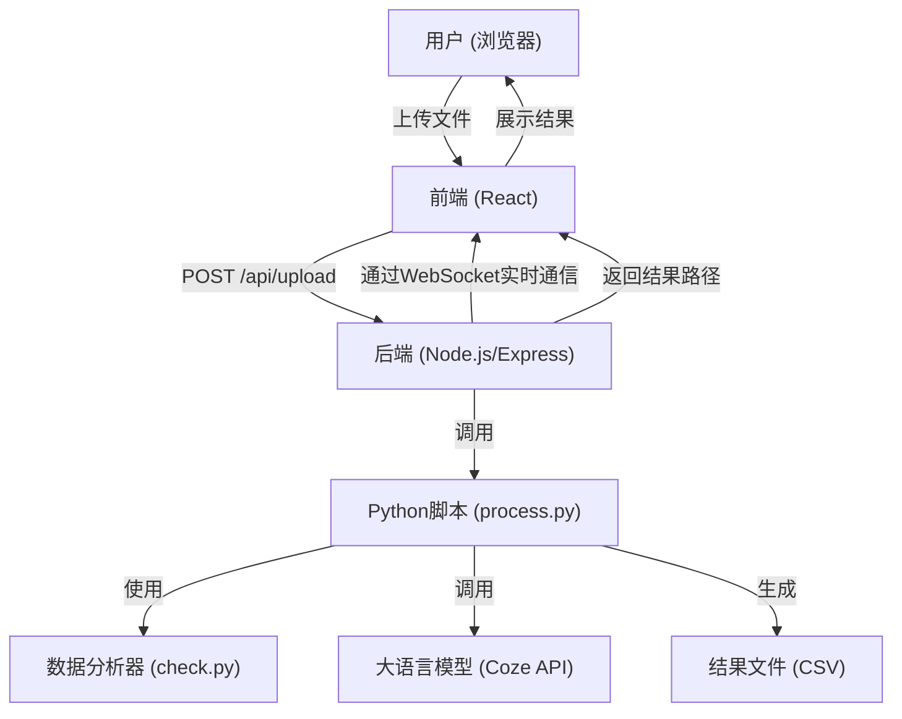

# 医疗数据验证与清洗系统技术说明文档

本文档旨在详细阐述医疗数据验证与清洗系统的技术实现，包括前端设计、后端架构、数据处理流程以及与大语言模型的集成。

## 1. 系统概述

本系统旨在帮助数据分析师和研究人员快速验证其医疗数据的质量，并提供智能化的清洗建议。用户通过Web界面上传一个"标准"数据集的元数据描述文件和一个待验证的数据文件（CSV或PKL格式）。系统会对待验证数据进行深度剖析，将其特征与标准进行对比，并利用大语言模型（LLM）给出专业的判断和可行的清洗方案。

## 2. 整体架构

系统采用前后端分离的现代化Web应用架构。

- **前端**: 基于React框架的单页面应用（SPA），负责用户交互、文件上传和结果展示。
- **后端**: 基于Node.js和Express的服务器，作为API网关，负责接收前端请求、管理文件、调用Python处理脚本，并通过WebSocket与前端进行实时通信。
- **数据处理核心**: 一系列Python脚本，负责数据的加载、深度分析、特征提取，并与第三方大语言模型服务进行交互。
- **第三方服务**: Coze（扣子）平台提供的Workflow API，用于执行大语言模型驱动的数据质量评估任务。

*（这是一个简化的架构图，用于说明各组件间的关系）*

## 3. 前端 (Client)

前端是基于 `React` 构建的。

- **UI组件**: 使用了 Ant Design 组件库来构建美观且一致的用户界面。
- **核心组件**: `FileUpload.js` 是系统的核心交互组件。
    - **文件上传**: 它提供了两个文件上传入口，分别用于上传"标准数据定义（CSV）"和"待验证数据（CSV/PKL）"。
    - **进度反馈**: 文件上传后，后端开始处理时，该组件通过WebSocket接收后端发送的实时进度信息（例如，已处理的列数百分比），并以进度条的形式展示给用户，提升了用户体验。
    - **结果展示**: 数据处理完成后，后端会返回结果文件的下载链接。前端将结果以结构化的表格形式清晰地呈现给用户，包括每个字段的"判断结果"、"问题类别"和"清洗建议"。
    - **错误处理**: WebSocket也用于接收处理过程中可能发生的任何错误信息，并实时反馈给用户。

## 4. 后端 (Server)

后端服务由 `Node.js` 和 `Express` 框架搭建。

- **API Endpoints**:
    - `POST /api/upload`: 这是核心的文件上传接口。它使用 `multer` 中间件来处理 `form-data` 格式的请求，接收`standard`和`validation`两个文件。接收到文件后，它不会直接处理，而是通过 `child_process.spawn` 调用核心的Python脚本 `process.py`，并将上传文件的路径作为命令行参数传递。
    - `GET /api/download/:filename`: 提供处理结果文件的下载功能。
- **实时通信**: 后端集成了一个 `WebSocket` (`ws`) 服务器。
    - **目的**: 解决数据处理过程可能耗时较长，HTTP请求会超时的问题。
    - **机制**: 当 `process.py` 脚本在标准输出（stdout）打印特定格式的进度信息（如 `PROGRESS:50.0`）时，Node.js服务会捕捉这些输出，解析进度，并通过WebSocket连接广播给所有前端客户端。
    - **心跳机制**: 为了维持连接的稳定性，服务器会定期向客户端发送 `ping` 信号，客户端响应 `pong`，避免因网络空闲导致连接被中断。

## 5. 数据处理核心 (Python Scripts)

这是系统的"大脑"，负责所有复杂的数据分析和与LLM的交互。

### 5.1 `process.py` - 流程编排器

该脚本是Node.js和核心分析逻辑之间的桥梁。

1.  **接收参数**: 从命令行接收三个参数：标准文件路径、待验证文件路径、输出结果文件路径。
2.  **加载数据**:
    - **标准数据**: 读取CSV格式的标准定义文件。该文件应包含 `column_name` 和 `info` 两列，其中 `info` 列是一个JSON字符串，描述了该字段的预期数据类型和值分布。
    - **待验证数据**: 支持加载 `.csv` 和 `.pkl` 文件。为了增强兼容性，它会依次尝试使用 `joblib`, `pandas`, `pickle` 库来加载 `.pkl` 文件。
3.  **调用 `check.py`**:
    - 它实例化 `check.py` 中的 `DataFrameChecker` 类，并调用其 `generate_report()` 方法。
    - 这一步的目的是对用户上传的待验证数据进行"画像"，生成一个包含每列数据类型、值范围、分布等信息的报告。
4.  **与大语言模型（LLM）API交互**:
    - **API服务**: 脚本硬编码了对 `Coze API` (`https://api.coze.cn/v1/workflow/run`) 的调用。这是一个外部的大模型工作流服务。
    - **数据准备**: 脚本遍历 `generate_report()` 生成的报告中的每一列（当前代码限制为前3列）。对于每一列，它提取出其数据画像（`info`）和标准数据中对应列的画像。
    - **API请求**: 将待验证列的画像和标准列的画像作为输入参数，发送给Coze Workflow。这相当于向大模型提问："一个字段实际的数据分布是A，而我们期望的分布是B，请判断A的质量，指出潜在问题，并给出清洗建议。"
    - **安全提示**: **API的`Authorization`凭证（Bearer Token）被硬编码在代码中，这是一个严重的安全风险。在生产环境中，应立即将其移至环境变量或安全的密钥管理服务中。**
5.  **生成结果**:
    - **解析响应**: 解析LLM API返回的JSON结果，提取出"判断结果"、"问题类别"和"清洗建议"。
    - **保存输出**: 将所有列的处理结果汇总成一个Pandas DataFrame，并最终保存为CSV文件，路径由输入参数指定。

### 5.2 `check.py` - 数据剖析器 (Profiler)

这个脚本定义了 `DataFrameChecker` 类，是数据质量评估的基础。

- **功能**: 它的核心功能是为给定的DataFrame的每一列生成详细的元数据报告。
- **类型推断 (`_detect_type`)**: 这是其最复杂的部分。它不依赖于Pandas的`dtype`，而是通过一系列规则和正则表达式对列中的数据进行采样和分析，以推断出更符合业务语义的数据类型。它能够识别：
    - 基础类型: `int`, `float`, `text`
    - 分类类型: `category_int`, `category_text` (当唯一值数量较少时)
    - 日期时间: `date` (支持多种常见格式，如 `YYYY-MM-DD`, `MM/DD/YYYY`, 时间戳等)
    - 列表类型: `list[int]`, `list[float]` (当单元格内容为数组形式的字符串时)
    - 未知类型: `unknown` (当列全为空时)
- **统计信息 (`_get_value_range`)**: 根据推断出的数据类型，计算相应的统计指标。
    - 对数值类型，计算`min`, `max`, `mean`, `median`等。
    - 对分类类型，列出所有`category_values`和`category_count`。
    - 对日期类型，计算`min_date`, `max_date`, `date_range_days`。
    - 统一计算`null_count`和`null_percentage`。
- **输出**: `generate_report()` 方法返回一个DataFrame，其 `info` 列就是一个包含上述所有类型和统计信息的JSON字符串，为后续与LLM的交互提供了结构化、信息丰富的输入。

## 6. 完整数据流（端到端）

1.  **用户操作**: 用户在浏览器中打开前端页面，选择标准文件和待验证文件，点击"上传并分析"按钮。
2.  **前端请求**: 浏览器向后端 `POST /api/upload` 发起请求，携带两个文件。
3.  **后端接收**: Node.js服务器接收请求，将文件保存到服务器的 `uploads/` 目录下，并生成唯一的临时文件名。
4.  **启动处理**: Node.js服务器启动一个子进程，执行 `python process.py <standard_path> <validation_path> <output_path>`。
5.  **数据画像**: `process.py` 调用 `check.py` 对 `<validation_path>` 文件进行分析，生成数据画像报告。
6.  **LLM评估**: `process.py` 循环遍历画像报告，将每列的数据特征与标准文件中的特征一起发送到Coze LLM API。
7.  **进度更新**: 在处理每一列时，`process.py` 计算进度百分比并打印到标准输出。Node.js父进程捕获此输出，通过WebSocket将其发送给前端，前端更新进度条。
8.  **结果生成**: `process.py` 收集所有LLM的返回结果，并将它们整理成一个CSV文件，保存在 `results/` 目录下。
9.  **处理完成**: Python脚本成功退出。Node.js服务器知道处理已完成，向最初的 `/api/upload` HTTP请求返回一个成功的JSON响应，其中包含结果文件的文件名。
10. **前端展示**: 前端收到成功的响应后，会向后端 `GET /api/download/:filename` 发起请求，获取结果CSV文件的内容，并将其解析和渲染成一个清晰的表格。

## 7. 总结与未来优化方向

本系统巧妙地结合了Node.js在I/O和并发方面的优势，以及Python在数据科学领域的强大生态。通过引入大语言模型，系统超越了传统的基于规则的数据验证，能够提供更具上下文感知能力和智能化的清洗建议。

**可优化点**:
- **安全性**: 如前所述，必须将硬编码的API密钥外部化。
- **性能**: `process.py`目前只处理前3列数据，这可能是出于测试目的。要处理所有列，需要考虑API调用的并发性（例如使用`asyncio`或多线程）以提高效率，避免处理时间过长。
- **可扩展性**: "标准"的定义可以更加丰富，支持更复杂的验证规则（如正则表达式、值域依赖关系等）。
- **容错性**: 增强Python脚本的错误处理，例如，当单个API调用失败时，可以进行重试，而不是直接跳过该列。
- **前后端交互**: 可以考虑使用更结构化的数据（如JSON）而非CSV来在前后端之间传递最终结果，以避免不必要的解析开销。
